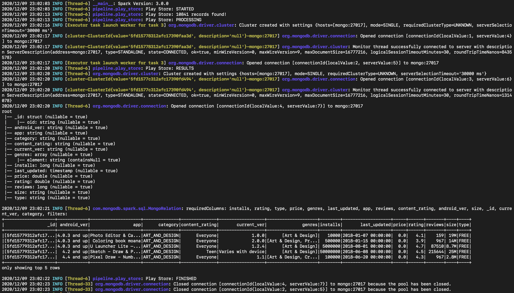

# 🐍️ PySpark App
By Anthony Vilarim Caliani

[](#) [](#) [](#) [](#)

In this project you will find some stuff that I've done while I was learning about working with PySpark and MongoDB.  
To develop this project I'm going to use a "Google Play Store Apps" dataset, so thanks to [@lava18](https://www.kaggle.com/lava18) for sharing it.


## Quick Start

First, let's retrieve the dataset...
1. Download the dataset from [Kaggle](https://www.kaggle.com/lava18/google-play-store-apps).  
2. Move or copy the `googleplaystore.csv` file to `datalake/raw/play-store` directory.

Alright, now execute the following steps.
```bash
# Build docker image
docker-compose build

# Up the container
docker-compose up -d

# Execute the PySpark job
docker-compose exec spark /app/run.sh
```

Let's check on [MongoDB](#mongo-link).




Finally, when you finish drop the container.
```bash
docker-compose down
```

That's all folks!